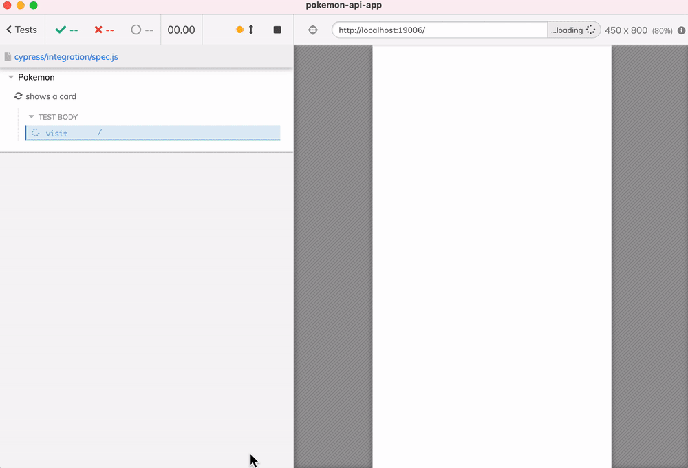

# pokemon-api-app 
> Pokemon React Native App

See the tests in [cypress/integration/spec.js](./cypress/integration/spec.js)

Original code copied from the article [Fetching Data in React Native](https://alialhaddad.medium.com/fetching-data-in-react-native-d92fb6876973) but re-implemented using [Expo](https://expo.io/)
